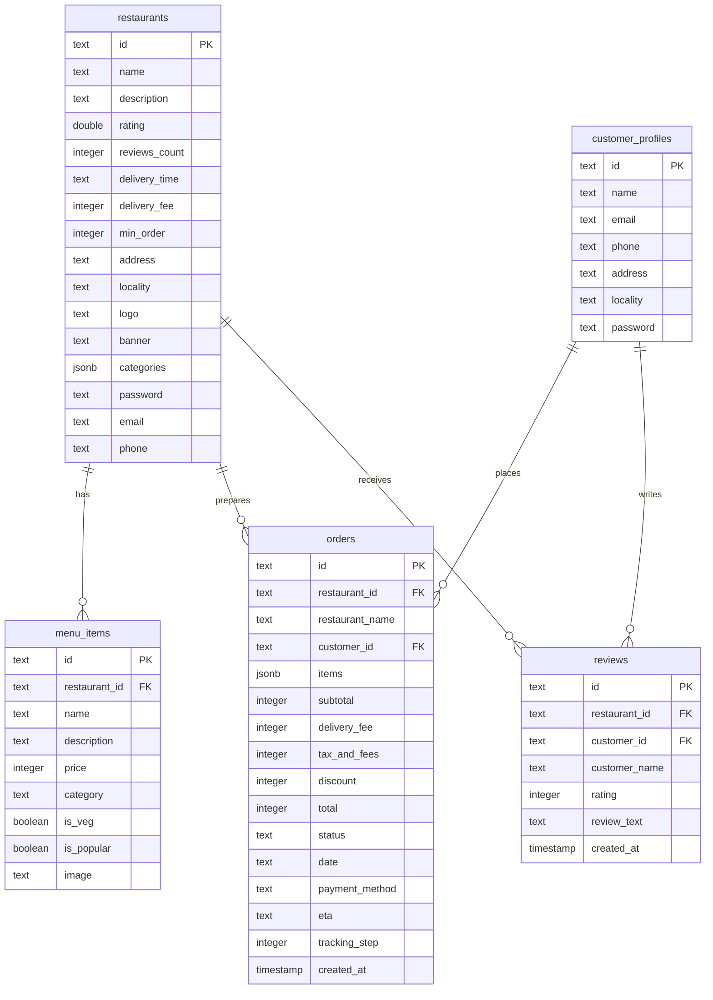

# 🕌 Lakhnawi Bites: Lucknow's Elite Culinary Network

> **Lakhnawi Bites** is a full-stack, responsive, and visually stunning food ordering multi-page application (MPA) built using modern web standards. Inspired by the rich culinary heritage of Lucknow, the application connects foodies with legendary local eateries—like *Tunday Kababi*, *Royal Cafe*, *Idris Biryani*, and *Prakash Kulfi*—across iconic localities including *Aminabad*, *Hazratganj*, and *Chowk*.

---

## 🍽️ Key Product Portals

### 1. 😋 Consumer Foodie Portal
Allows customers to order signature dishes, manage profiles, and track active deliveries.
* **Profile Selection:** Quick-swap between customized test profiles (like Keshav Pandey or Priya Sharma) directly from the landing page.
* **Gourmet Catalog:** Browse legendary eateries with custom filtering (Veg/Non-Veg) and tags (Popular, Kebabs, Street Food, Biryani, Breads, Desserts).
* **Sliding Cart Drawer:** A premium shopping bag experience containing custom preparation notes, real-time quantity modifiers, and automated pricing details.
* **Simulated Checkout:** Enforce mock UPI, Credit/Debit card, and Cash-on-Delivery payment simulations with real-time success state feedback.
* **Robust Reviews & Ratings:** Enforce database persistence for ratings. In case of database connection failures, a built-in **offline local storage fallback** catches review submissions and dynamically recalculates average restaurant ratings locally.

### 2. 👨‍🍳 Kitchen Owner Portal
A dedicated workspace dashboard designed for restaurant operators to handle incoming orders and maintain menus.
* **Order Workspace Queue:** Track incoming orders in real-time. Operators can update cooking statuses (Pending ➡️ Preparing ➡️ Dispatched ➡️ Delivered).
* **Dynamic Menu Catalog Management:** Add new dishes to the menu with image URLs, details, pricing, and category filters. Modify price tags instantly with server-side synchronization.

### 3. 📍 Live GPS Order Tracking
* **Leaflet JS Integration:** Real-time interactive map tracks the rider's progress from the restaurant to the user's locality using live GPS pin markers and customized routing polylines.
* **Order Progress Timeline:** Visual tracking step tracker showing the delivery status step-by-step.

---

## 🛠️ Technology Stack & Libraries

* **Frontend:**
  * **Core Logic:** Vanilla JavaScript (ES Modules)
  * **Styling & Aesthetics:** Vanilla CSS, HSL tailored palettes, glassmorphic dark-mode overlay components, [Bootstrap 5.3.3](https://getbootstrap.com/), and [Tailwind CSS v4](https://tailwindcss.com/) (Vite Plugin).
  * **Interactive Maps:** [Leaflet JS v1.9.4](https://leafletjs.com/)
* **Backend:**
  * **Server:** [Express.js](https://expressjs.com/) (Node.js) serving API endpoints and bundling SPA/MPA assets.
* **Database & ORM:**
  * **Database:** PostgreSQL
  * **Object Relational Mapper:** [Drizzle ORM](https://orm.drizzle.team/)
  * **Driver:** Node-Postgres (`pg`)
* **Build System:**
  * **Bundler:** [Vite v6](https://vite.dev/)
  * **Build Target Bundler:** [esbuild](https://esbuild.github.io/)

---

## 📂 Project Directory Structure

```markdown
├── dist/                          # Compiled build output folder (HTML, CSS, JS, server)
├── src/
│   ├── controllers/               # Frontend business logic modules
│   │   ├── auth.js                # Login, logout, registration, forgot password handlers
│   │   ├── cart.js                # Cart drawer state, checkout flows, payment processing
│   │   └── restaurant.js          # Kitchen operator workspace inputs and edits
│   ├── data/
│   │   └── restaurants.js         # Initial seed dataset of Lucknow eateries and menus
│   ├── db/
│   │   ├── drizzle.config.js      # Drizzle migrations configuration
│   │   ├── index.js               # PostgreSQL connection pool using Drizzle
│   │   └── schema.js              # Database tables schema and relations definitions
│   ├── views/                     # Modular view templates and layout engines
│   │   ├── homeView.js            # Consumer categories and restaurant lists
│   │   ├── menuView.js            # Restaurant menu list rendering
│   │   ├── modalsView.js          # Cart sliding drawer and modals
│   │   ├── portalLandingView.js   # Main gateway portal landing structure
│   │   ├── profileView.js         # User profile details and settings editing
│   │   ├── restaurantView.js      # Kitchen workspace interface panels
│   │   └── trackingView.js        # Leaflet JS interactive map and order timeline
│   ├── api.js                     # Client-side fetch wrappers connecting to backend APIs
│   ├── events.js                  # Frontend global event listener bindings router
│   ├── index.css                  # Core global stylesheet and design system tokens
│   ├── main.js                    # Entrypoint bundle loading server state
│   ├── render.js                  # Layout engine router showing views dynamically
│   └── state.js                   # Application global state and localStorage sync
├── server.js                      # Express JS server & API route handlers
├── package.json                   # Project scripts and dependency declarations
├── vite.config.js                 # Vite bundler configurations
└── index.html | home.html ...     # MPA physical page wrappers
```

---

## 🗄️ Database Schemas & Relations

The PostgreSQL database is organized into 5 relational tables declared in `src/db/schema.js`:



---

## ⚡ Setup & Installation

### 1. Prerequisites
Ensure you have [Node.js](https://nodejs.org/) installed on your machine.

### 2. Configure Environment Variables
Create a `.env` file in the root directory (using `.env.example` as a template) and add your database configuration:
```env
# Database Credentials
SQL_HOST=your_postgres_host
SQL_USER=your_postgres_user
SQL_PASSWORD=your_postgres_password
SQL_DB_NAME=your_postgres_db_name
SQL_ADMIN_USER=your_postgres_admin_user
SQL_ADMIN_PASSWORD=your_postgres_admin_password
```

### 3. Install Dependencies
```bash
npm install
```

### 4. Database Migrations (Drizzle)
Push your schema directly to the database:
```bash
npx drizzle-kit push
```

### 5. Running the Application
* **Development Mode:** Runs the Express server using `tsx` (which starts the Vite dev middleware automatically):
  ```bash
  npm run dev
  ```
  Open `http://localhost:3000` in your web browser.

* **Production Mode:** Build and bundle static assets first, then launch the optimized production server:
  ```bash
  npm run build
  npm run start
  ```
